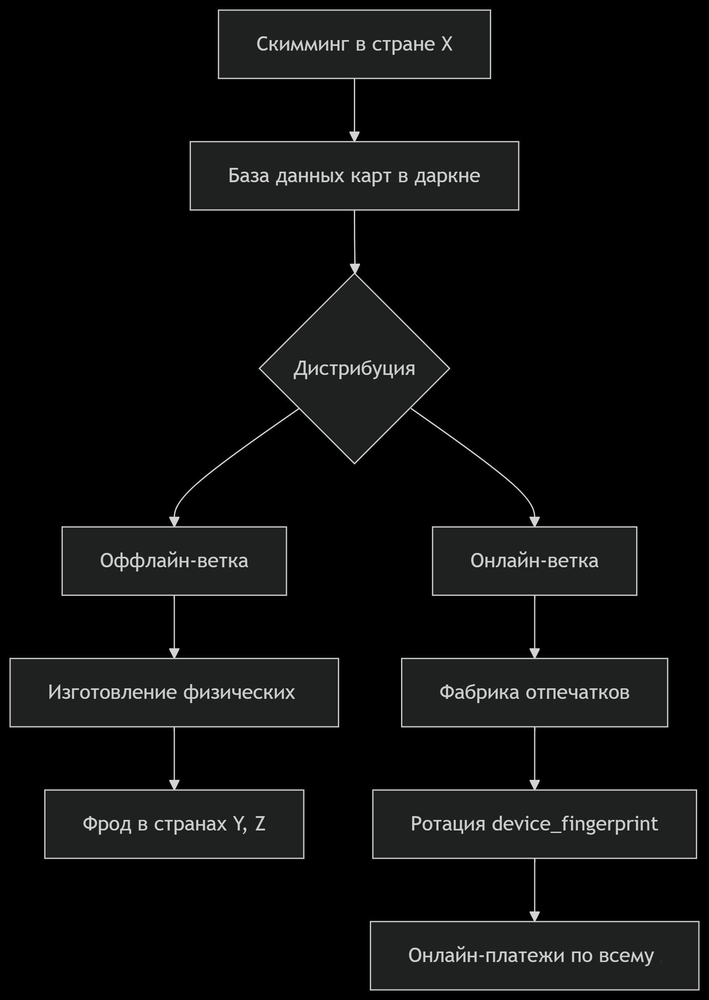

# README — Исследование фродовых транзакций

| Параметр                         | Краткое содержание                                                                                                                                              |
|----------------------------------|------------------------------------------------------------------------------------------------------------------------------------------------------------------|
| **Предложенное решение**         | Наилучший сценарий: блокировка транзакций, проходящих через устройства, по цифровому отпечатку которых ранее фиксировались подтверждённые фродовые операции  |
| **Ожидаемая экономия**           | $85,459,113,519.87 (это ~48% от всей оценки фрода)                                                                                            |
| **Продуктовые / технические гипотезы** | "Физический скимминг с последующей эмуляцией карт (офлайн-фрод)" и "Фабрика цифровых отпечатков / спуфинг (глобальная ротация `device_fingerprint`)" |
| **Наиболее важные признаки**     | `customer_id`, `device_fingerprint`, `is_fraud`, `is_card_present`, `channel`, `country`                                                                          |
| **Дата**                         | 2025-08-14                                                                                                                |

## Оглавление
1. Краткое описание данных 
2. Важные закономерности
3. Гипотезы по характеру фрода
4. Решение и ожидаемые результаты

## Краткое описание данных

**Для анализа использовались два набора данных:**
 - `transaction_fraud_data.parquet`: Основной файл, содержащий анонимизированные транзакции с такими признаками, как сумма, категория продавца, география, информация об устройстве и метка мошенничества (is_fraud).
 - `historical_currency_exchange.parquet`: Вспомогательный файл с обменными курсами валют.

В датасетах представлено **7,483,766** уникальных транзакций и **4869** пользователей. 

## Важные закономерности
- Между множествами `device_fingerprint`, использовавшихся для легитимных и фродовых транзакций, наблюдается **отсуствие пересечений** → отпечатки используются исключительно для фрода.
- В среднем по пользователю:  
  - `is_fraud == False` → ~**2** уникальных отпечатка устройств → регулярыне устройства пользователя 
  - `is_fraud == True` → ~**306** уникальных отпечатков устройств  
- Наблюдается сценарий, когда **несколько пользователей** (customer_id) используют один и тот же фродовый `device_fingerprint`
- Все оффлайн тразакции ( `is_card_present == True`) → носят фродовый характер

## Гипотезы-по-характеру-фрода 

### 1. Физический скимминг → Оффлайн-фрод
**Что:** Кража данных карт через компрометированные POS-терминалы (накладки, шимминг, вредоносное ПО)  
**Доказательства:**
  - 100% оффлайн-транзакций (физическое предъявление карты) — фрод
  - География: Операции по всему миру (клоны карт физически везут/используют в целевых странах (Russia, Mexico, Brazil, Nigeria, Austalia)) 
**Схема:**
  `Скимминг в стране А → Изготовление физических клонов → Обналичивание в странах B, C, D`  

### 2.Фабрика цифровых отпечатков (спуфинг) → Онлайн-фрод  
**Что:** Промышленная генерация временных `device_fingerprint` для маскировки онлайн-атак
**Доказательства:**
  - ~300 уникальных отпечатков на фродового пользователя за месяц
  - Нет привязки к вендорам/локациям (глобальные транзакции во всех категориях)  
**Как работает:**
  - Мошенник использует инструменты (эмуляторы, ботнеты) для смены отпечатка перед каждой (или серией) транзакций.  

## Решение и ожидаемые результаты

### 1. Решение для оффлайн-фрода  
**Действия:**
- Автоматически снижать лимиты для карт, совершающих транзакции в географически несовместимых локациях
- Ввести мгновенную блокировку терминалов с аномальной концентрацией фрода (>30% транзакций) 

**Ожидаемые результаты**:  
- Уменьшение ущерба от крупных фродовых операций
- Уменьшение ущерба от POS-терминалов

### 2. Решение для онлайн-фрода 
**Действия:**
- Добавление двойной аутентификации в случае нового `device_fingerprint`
- Блокировать ротацию отпечатков: Лимит 5 уникальных `device_fingerprint` на пользователя в неделю (порог для фабрик)
- Детектировать пересечения устройств: При выявлении одного `device_fingerprint` у >3 пользователей за 24 часа → автоматическая проверка всех связанных транзакций
- Вести чёрный список отпечатков: Автоблокировка устройств из графа связей с подтверждённым фродом  

**Ожидаемые результаты:**
- Сокращение онлайн-фрода за счет снижения эффективности фабрик  

### 3. ML-детекция: Система динамического кредитного скоринга 
**Суть:** Динамический скор риска, обновляемый в реальном времени

**Ключевые концепции:**
1. **Цифровая репутация:**
   - Каждому пользователю присваивается скор (0-100), обновляемый после каждой транзакции.  
2. **Сигналы для расчета:**
   - Скорость смены устройств  
   - Гео-аномалии  
   - Связи с фродовыми устройствами  
   - История оффлайн-фрода
   - тд 
3. **Автоматические действия:** 
   - 0-30: Пропуск  
   - 31-70: Доп. аутентификация  
   - 71-100: Блокировка  

### Эффект 
**Суть:** `Blacklist device_fingerprint` - Блокировка всех транзакций через устройства, где до этого уже была подтверждена фродовая операция с последующем оповещением пользователя и заменой карты пользователя

**Результат:** 
- Экономия: $85,459,113,519.87 (48% от фрода)  
- Побочный эффект: Ложные срабатывания
  
**Сложность:**
 - Успеть определить что операция фродовая, пока не была соверешена последующая транзакция с данного устройства

####  Ключевые принципы:  
1. Для оффлайна: Физическая защита терминалов + "умные" лимиты  
2. Для онлайна: Борьба с ротацией устройств + графовый анализ пересечений
3. Для ML:Динамический скорнинг, обновляемый в реальном времени  

